# Cryptocurrencies

## Purpose of the project:

We will use unsupervised machine learning to group cryptocurrencies of current trading market to show the leadership of 

Accountability Accounting company a possible cryptocurrency investment portfolio.

The process includes the data cleaning and transformation, reducing dimensions by PCA (principal component analysis), K-means clustering and final data visualization.

### Results:

- #### Deliverable 1: Preprocessing the Data

​		The data is shown below:

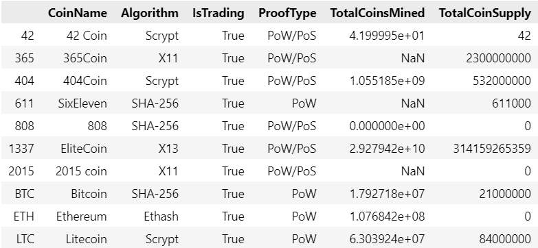

​		We only choose the data with active trading, non-null value, and workable algorithms.  The data is cleaned and shown below:

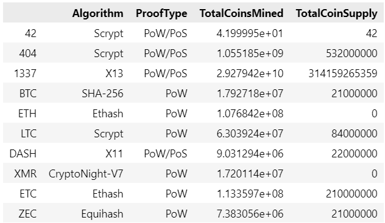

After scaling and encoding, the data is shown as:

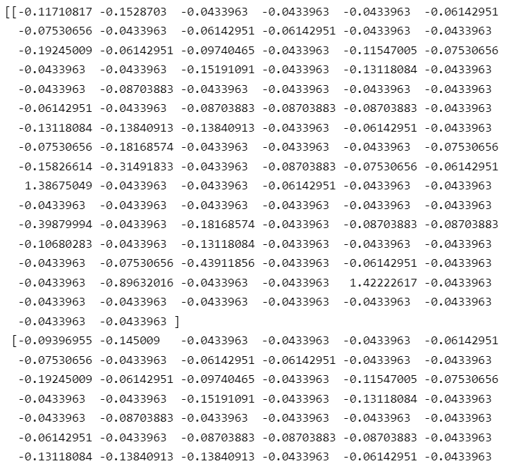

- ### Deliverable 2: Reducing Data Dimensions Using PCA

​		Data after the 3-component PCA dimension reduction:

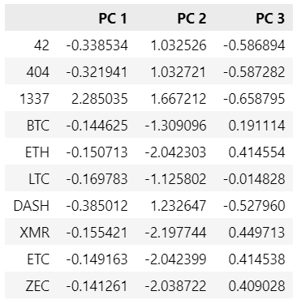

- ### Deliverable 3: Clustering Cryptocurrencies Using K-means

​		Elbow curve of K-means inertia:

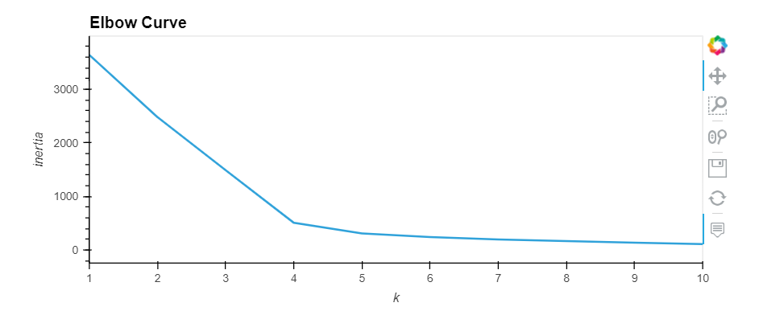

​		Data after K-means clustering:

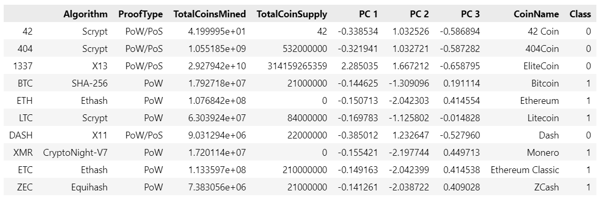

- #### Deliverable 4: Visualizing Cryptocurrencies Results

​	

​		3D Visualization of 3-components of PCA:

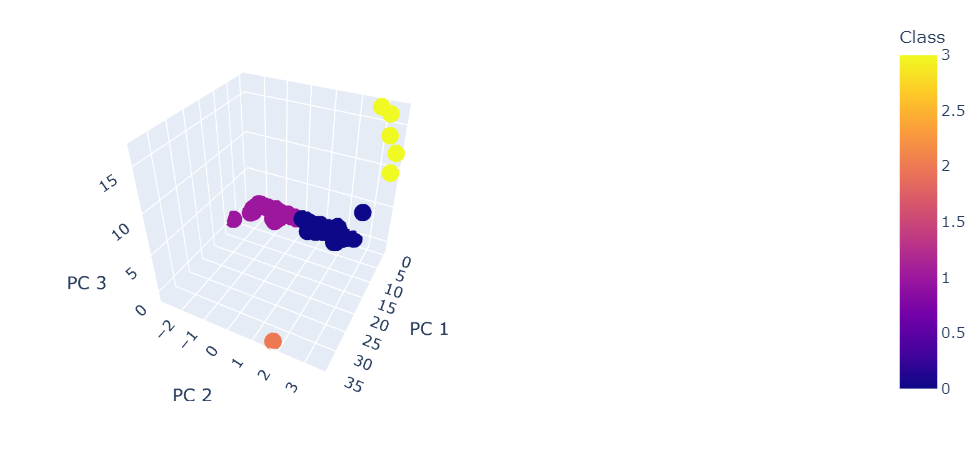

​		Classification results table:

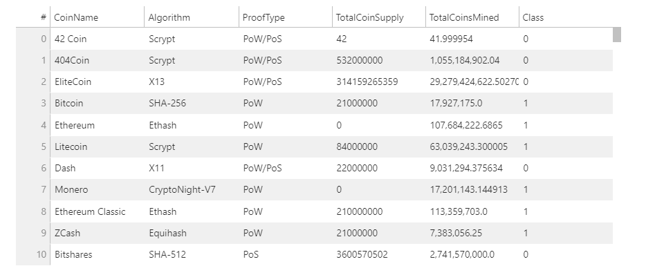

​		Total number of tradable cryptocurrencies:

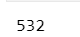

​		Scaled TotalCoinSupply and TotalCoinsMined with CoinName and Class:

​		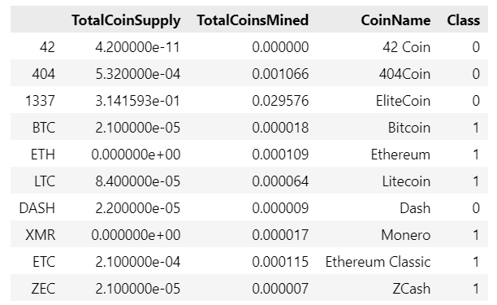

​		Scatter plot of above data:

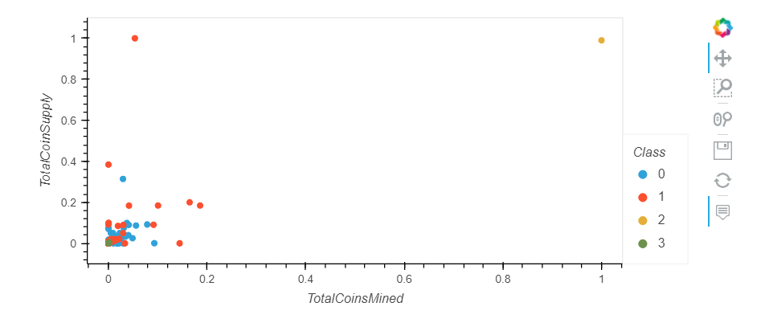

